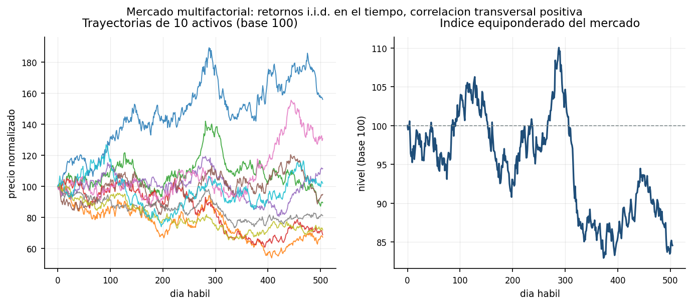
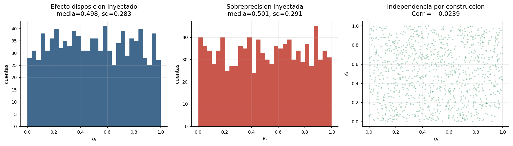
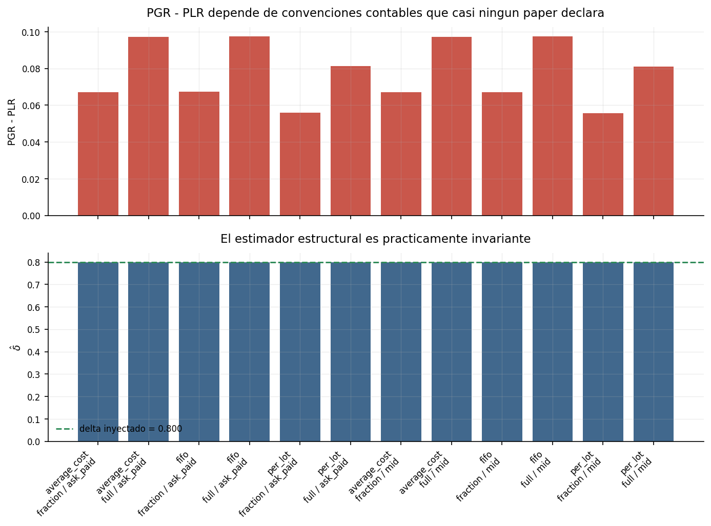
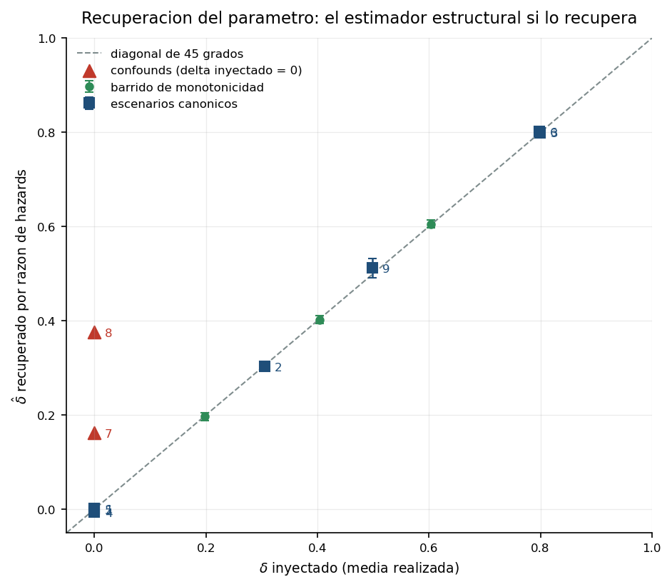
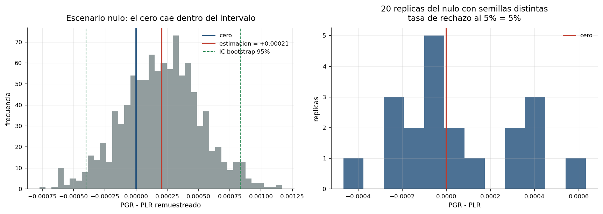
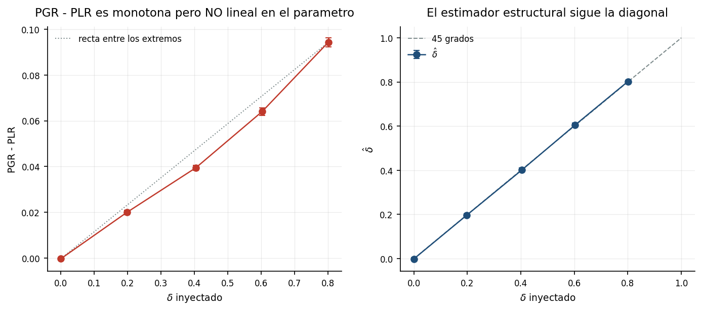
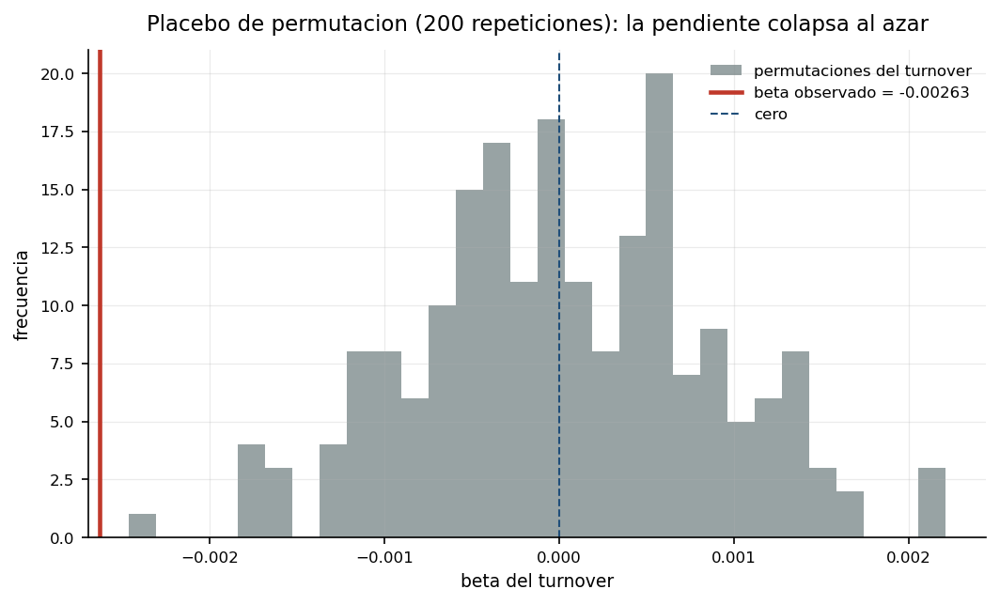
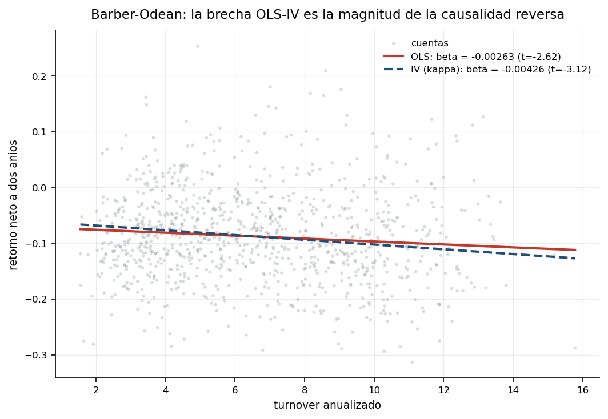
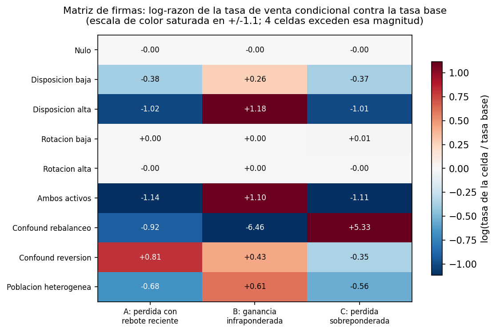

# Cuándo mienten los estimadores de sesgos conductuales

### Una auditoría con *ground truth* conocido sobre un mercado simulado

- **Materia:** Comportamiento en las Finanzas y Toma de Decisiones
- **Institución:** ITESO, Universidad Jesuita de Guadalajara
- **Alumno:** [TU NOMBRE]
- **Profesor:** [NOMBRE DEL PROFESOR]
- **Fecha:** 18 de septiembre de 2026

---

## 1. Resumen ejecutivo

Construí un mercado sintético de 60 activos y 504 días hábiles con 1000 agentes cuyos sesgos conductuales son parámetros que yo inyecto y por lo tanto conozco, corrí sobre él los estimadores estándar de la literatura y comparé lo estimado contra lo inyectado. Tres resultados.

**Primero: el estimador clásico de Odean no estima el parámetro; el estructural sí.** El estimador por razón de tasas de riesgo recupera `δ` con error absoluto máximo de **0.014** en los siete escenarios sin *confound*, típicamente menor a 0.003. En cambio `PGR − PLR` cambia **+53%** entre dos escenarios con **exactamente el mismo `δ` inyectado** (0.800 y 0.799) que sólo difieren en la propensión a operar: 0.0971 contra 0.1490. La medida publicada del efecto disposición no es comparable entre poblaciones con distinta rotación. La razón `PGR/PLR` va en la dirección correcta pero subestima la razón de hazards verdadera hasta **−24%**.

**Segundo: los errores estándar de `PGR − PLR` están mal por un factor de ~35, incluso haciéndolos "bien".** Ignorar el agrupamiento por cuenta los subestima 2.1×, como advierte la literatura. Pero medí algo que casi nunca se mide: la dispersión del estimador **entre trayectorias de mercado independientes**. En el escenario de disposición alta esa dispersión es **16.6 veces** el error estándar bootstrap agrupado por cuenta, que está condicionado a una sola realización del mercado y es ciego a esa variación. El `z = 91` de mi tabla es condicional; el incondicional es del orden de 2.6. Para `δ̂` el mismo factor es 1.12: sus estadísticos sí son honestos.

**Tercero: `PGR − PLR` no separa mecanismos, pero tres celdas discriminantes sí.** Los escenarios 3 (disposición), 7 (rebalanceo) y 8 (reversión) dan los tres un `PGR − PLR` positivo y significativo, los dos últimos con `δ = 0` inyectado, y son indistinguibles con ese estimador; con el vector de tres tasas de venta condicionales quedan perfectamente separados, con coseno ≥ 0.97 con la firma correcta y ≤ 0.02 con la siguiente. Como subproducto, el estadístico de horizontes de tenencia de Odean (1998) resulta arrastrado por la deriva del mercado: sobre 20 réplicas del nulo con `δ = 0`, su correlación con el retorno realizado es **+0.797 (t = 5.60)** y en **7 de 20** trayectorias la brecha tiene el signo que se lee como "efecto disposición".

---

## 2. Motivación y diseño experimental

Con datos reales no existe *ground truth*: un coeficiente positivo es compatible con un sesgo psicológico, con una regla institucional, con un efecto de composición y con un error de código, y la literatura resuelve la ambigüedad con argumentos, no con evidencia. Aquí se resuelve por construcción, y la pregunta pasa a ser **¿cuándo mienten los estimadores?**. Eso cambia el criterio de éxito: un desacuerdo entre lo inyectado y lo estimado es el producto del trabajo, no un fracaso.

Dos condiciones lo hacen legítimo. **Cero fuga de información**: la matriz completa de precios se genera antes de instanciar un solo agente, con un generador propio, y los agentes sólo la ven a través de un `PriceView` que levanta `LookAheadError` ante cualquier lectura de un día futuro; empíricamente, el retorno futuro a 20 días de los activos comprados, en exceso del transversal, es indistinguible de cero sobre ocho trayectorias independientes y no correlaciona con el turnover de quien los compró. Y **el parámetro inyectado está un nivel por debajo de la cantidad estimada**: no existe en el código ninguna sentencia `if ganancia: vender con probabilidad p`, que sólo se reflejaría a sí misma.

---

## 3. Diseño del simulador

### 3.1 El mercado

Los retornos logarítmicos diarios siguen un modelo de tres factores con `Δt = 1/252`:

```
r_{m,t} = (μ_m − ½σ_m²)·Δt + β_{m,1}·F_{1,t} + β_{m,2}·F_{2,t} + β_{m,3}·F_{3,t} + ε_{m,t}
```

`F₁` es el factor de mercado (μ = 8%, σ = 16% anuales), `F₂` uno sectorial (σ = 12%) y `F₃` un segundo factor de estilo ortogonal (σ = 8%). Las betas se sortean uniformes en `[0.65, 1.35]`, `[−0.6, 0.6]` y `[−0.4, 0.4]`; la volatilidad idiosincrática en `[12%, 28%]`; los precios iniciales en `[25, 150]`. La corrección de Itô usa la varianza **total** del activo, de modo que la deriva del retorno simple quede en `β₁·μ_mercado`.

El modelo de factores es superior al GBM independiente porque genera correlación transversal realista —**0.322** de correlación media entre activos— y con ella riesgo no diversificable: sin ese riesgo el control de volatilidad de Barber-Odean sería ruido, y con él resulta decisivo para diagnosticar el escenario 7. Los factores y el ruido son i.i.d. en el tiempo, así que **no hay momentum ni reversión real**: la autocorrelación agrupada en los rezagos 1 a 10 cae dentro de la banda nula por permutación temporal conjunta, con máximo de |0.011|. Eso convierte al escenario 8 en un *confound* genuino.

Cada escenario genera su **propia** trayectoria: es una economía independiente. Eso impide que una sola realización afortunada gobierne las conclusiones, pero implica que los niveles de retorno no son comparables entre escenarios; las trayectorias van de −19.0% a +104.8% a dos años.



### 3.2 La regla de decisión

Cada agente `i` tiene dos parámetros inyectados, `δ_i ∈ [0,1]` (efecto disposición) y `κ_i ∈ [0,1]` (sobreprecisión / churn), que modulan una **tasa de riesgo diaria**:

```
h_0(κ_i)  = h_base + c_κ·κ_i          h_base = 0.015,  c_κ = 0.060
h_gain    = min(0.99, h_0·(1 + δ_i))  posición por encima del precio de referencia
h_loss    = max(1e-4, h_0·(1 − δ_i))  posición por debajo
h_neutral = h_0
```

`h_base = 0.015` corresponde a un horizonte medio de `1/0.015 ≈ 67` días hábiles, del orden de los horizontes minoristas de Odean (1998), y la simulación lo confirma como comportamiento emergente: en el escenario nulo la mediana de tenencia es **62.0** días para ganadoras y **65.5** para perdedoras. `PGR`, `PLR`, el turnover y los horizontes **emergen** de la interacción entre esta tasa, la trayectoria y el tiempo que la posición lleva abierta; nunca son inputs.

### 3.3 Distribuciones, no escalares

Con objetivo distinto de cero, `δ_i` y `κ_i` se sortean de una Beta reparametrizada por media y concentración (`a = m·ν`, `b = (1−m)·ν`, `ν = 20`) desde **dos flujos independientes**. Con objetivo cero se usa el valor exacto 0 para todos, porque la ausencia del sesgo es el punto del escenario, y la consecuencia —que la correlación no esté definida— se reporta como `n/d`, nunca como `0.0000`.



### 3.4 Costos y dos libros contables

Comisión fija de **$1.00 USD por orden** y spread bid-ask total de **10 puntos base** (medio spread 5 bps): las compras ejecutan al ask `P·(1.0005)` y las ventas al bid `P·(0.9995)`. Ambos son parámetros de línea de comandos.

Dentro del mismo bucle corren dos libros con las mismas decisiones, fechas, activos y cantidades en unidades: el **neto** (bid/ask con comisión) y el **bruto** (precio medio, sin comisión). Así `r_gross − r_net` es exactamente el costo acumulado y `β_gross` queda limpio de la definición de costos. La identidad se verifica con error máximo de **4.3e-15** y la conservación de valor (`efectivo + posiciones + costos = riqueza inicial + P&L de mercado`) con **4.1e-15**, nueve órdenes de magnitud bajo la tolerancia pedida.

Como el libro bruto conserva las cantidades en unidades, el efectivo que ahorra queda ocioso; por eso reporto además `gross_return_comp`, el retorno bruto capitalizado por composición diaria de los costos, cuya diferencia con el anterior es de segundo orden.

---

## 4. Decisiones contables declaradas

Las cuatro decisiones exigidas están implementadas de verdad y son seleccionables por configuración.

1. **Ventas parciales.** La venta liquida una fracción sorteada de `{0.25, 0.50, 1.00}` con probabilidades `{0.25, 0.25, 0.50}`. Acumulo **las dos convenciones de conteo en la misma corrida**: `partial_as_full` (cuenta 1) y `partial_as_fraction` (cuenta `f`, con `1−f` del lado de papel).
2. **Base de costo.** `fifo`, `average_cost` y `per_lot`, con lista real de lotes por posición: en el escenario nulo cada agente abre 128 lotes contra 17.9 posiciones de capacidad media. La unidad de decisión es la posición bajo las dos primeras y el lote bajo la tercera.
3. **Posición exactamente al costo.** Se clasifica como **neutral** y queda fuera de los conteos. Ocurrencias: **0 de 79 183 286** días-unidad; con precios continuos la igualdad exacta no ocurre nunca. La regla existe y está probada con un caso construido a mano.
4. **Precio de referencia.** Comparo el precio medio de hoy contra el del día de compra, no contra el ask pagado, porque esto último introduce un sesgo de medio spread hacia "pérdida".

### La tabla que importa

Rejilla completa sobre el escenario 3 (`δ = 0.80` inyectado), con la misma trayectoria y la misma población en las doce celdas:

| base de costo | conteo parcial | referencia | PGR − PLR | PGR/PLR | δ̂ |
|---|---|---|---|---|---|
| fifo | completo | mid | 0.09738 | 5.328 | 0.79935 |
| fifo | fracción | mid | 0.06714 | 5.359 | 0.79935 |
| fifo | completo | ask | 0.09758 | 5.325 | 0.79929 |
| fifo | fracción | ask | 0.06728 | 5.355 | 0.79929 |
| promedio | completo | mid | 0.09712 | 5.390 | 0.79935 |
| promedio | fracción | mid | 0.06697 | 5.425 | 0.79935 |
| promedio | completo | ask | 0.09733 | 5.387 | 0.79936 |
| promedio | fracción | ask | 0.06714 | 5.422 | 0.79936 |
| por lote | completo | mid | 0.08106 | 6.456 | 0.79957 |
| por lote | fracción | mid | 0.05578 | 6.478 | 0.79957 |
| por lote | completo | ask | 0.08133 | 6.461 | 0.79969 |
| por lote | fracción | ask | 0.05599 | 6.489 | 0.79969 |

`PGR − PLR` va de **0.0558 a 0.0976**: un rango relativo del **75%** producido íntegramente por convenciones que casi ningún paper declara. El estimador estructural va de 0.79929 a 0.79969: **0.05%**. El conteo de ventas parciales explica −31% del rango y la base de costo otro −17%, y son aproximadamente separables.

La referencia `ask_paid` casi no mueve nada (+0.00023). **Ésa es una predicción del pre-análisis que falló**: anticipé un efecto apreciable, y el mecanismo era correcto pero la magnitud no, porque 5 bps de sesgo son despreciables frente a un movimiento diario típico de ~1.6%. Para ubicar la frontera repetí la rejilla con un spread de mercado ilíquido (200 bps): el efecto sube a **+0.00531**, escalando casi linealmente con el spread. La elección de referencia importa en activos ilíquidos y no en líquidos, que es más informativo que mi predicción original.



---

## 5. Pre-análisis

`PRE_ANALISIS.md` se escribió y se registró **antes** de correr un solo estimador, en el commit `2d5dfc9` del 18 de septiembre de 2026, que contiene únicamente ese archivo y es el segundo de la historia de git. Todo lo posterior es resultado. Reproduzco las expectativas registradas (documento completo en `PRE_ANALISIS.md`):

> **Estimador de Odean.** «Como `PGR ≈ h_gain` y `PLR ≈ h_loss`, la predicción algebraica es `PGR − PLR ≈ 2·δ·h₀` y `PGR/PLR ≈ (1+δ)/(1−δ)`. […] **Predicción central y arriesgada:** `PGR − PLR` **no** es una estimación de `δ`. Escala con `h₀`, es decir con `κ`. El escenario 6 tendrá un `PGR−PLR` cuatro veces mayor que el escenario 3 pese a tener exactamente el mismo `δ`.»
>
> **Estimador estructural.** «Expectativa: **este sí recupera el parámetro inyectado**, con error absoluto `|δ̂ − E[δ]| < 0.05` en los escenarios 1–6. […] Predicción: en el escenario 9 (`E[δ] = 0.5`) el `δ̂` agregado saldrá **por encima de 0.5**.»
>
> **Barber-Odean.** «La expectativa ingenua de que en el escenario nulo los dos estimadores estén callados es probablemente falsa para `β_net`. […] **`β_net` debería caer en el rango `[−0.004, −0.001]`**.»
>
> **Independencia.** «`Corr(δ,κ) ≈ 0`; `Corr(δ, Turnover)` negativa y apreciable (`< −0.2`); `Corr(κ, Turnover)` fuertemente positiva (`> +0.6`).»
>
> **Celdas discriminantes.** «Disposición: A baja, B alta, C baja. Rebalanceo: A base, B baja, C alta. Reversión: A alta, B base, C base. Predicción: los escenarios 3, 7 y 8 serán indistinguibles por `PGR−PLR` pero separables por el patrón de signos.»

---

## 6. Tabla principal de resultados

Nueve filas. Tablas completas en `outputs/tabla_principal.md` y `outputs/tabla_diagnosticos.md`.

| # | escenario | δ iny (sd) | κ iny (sd) | PGR | PLR | PGR−PLR | SE | z | PGR/PLR | δ̂ | SE(δ̂) | error rec. |
|---|---|---|---|---|---|---|---|---|---|---|---|---|
| 1 | Nulo | 0.000 (0) | 0.000 (0) | 0.0575 | 0.0573 | +0.0002 | 0.0003 | 0.67 | 1.004 | +0.0020 | 0.0029 | +0.0020 |
| 2 | Disposición baja | 0.305 (0.105) | 0.000 (0) | 0.0700 | 0.0407 | +0.0294 | 0.0005 | 55.4 | 1.723 | +0.3031 | 0.0044 | −0.0018 |
| 3 | Disposición alta | 0.800 (0.085) | 0.000 (0) | 0.1192 | 0.0221 | +0.0971 | 0.0011 | 91.5 | 5.390 | +0.7994 | 0.0033 | −0.0003 |
| 4 | Rotación baja | 0.000 (0) | 0.301 (0.101) | 0.0683 | 0.0688 | −0.0005 | 0.0003 | −2.09 | 0.992 | −0.0063 | 0.0020 | −0.0063 |
| 5 | Rotación alta | 0.000 (0) | 0.799 (0.085) | 0.0892 | 0.0892 | −0.0000 | 0.0002 | −0.06 | 1.000 | −0.0003 | 0.0013 | −0.0003 |
| 6 | Ambos activos | 0.799 (0.090) | 0.802 (0.087) | 0.1766 | 0.0275 | +0.1490 | 0.0012 | 125.3 | 6.418 | +0.8015 | 0.0031 | +0.0029 |
| 7 | Confound rebalanceo | 0.000 (0) | 0.000 (0) | 0.0507 | 0.0384 | +0.0124 | 0.0007 | 17.5 | 1.322 | **+0.1620** | 0.0083 | **+0.1620** |
| 8 | Confound reversión | 0.000 (0) | 0.000 (0) | 0.0883 | 0.0474 | +0.0409 | 0.0005 | 90.5 | 1.864 | **+0.3764** | 0.0019 | **+0.3764** |
| 9 | Heterogéneo | 0.498 (0.283) | 0.501 (0.291) | 0.1193 | 0.0461 | +0.0732 | 0.0019 | 39.3 | 2.588 | +0.5120 | 0.0106 | +0.0139 |

| # | β_gross (p) | β_net (p) | β_IV neto | F 1ª etapa | Corr(δ,κ) | Corr(δ,turn) | Corr(κ,turn) | turnover |
|---|---|---|---|---|---|---|---|---|
| 1 | +0.0081 (0.37) | +0.0053 (0.56) | n/d | n/d | n/d | n/d | n/d | 3.07 |
| 2 | +0.0487 (0.00) | +0.0454 (0.00) | n/d | n/d | n/d | −0.079 | n/d | 3.07 |
| 3 | +0.0617 (0.00) | +0.0590 (0.00) | n/d | n/d | n/d | −0.550 | n/d | 1.98 |
| 4 | +0.0013 (0.71) | −0.0027 (0.42) | −0.0043 | 3663 | n/d | n/d | +0.894 | 6.21 |
| 5 | −0.0024 (0.41) | −0.0059 (0.04) | −0.0063 | 1534 | n/d | n/d | +0.773 | 11.25 |
| 6 | +0.0066 (0.00) | +0.0028 (0.21) | −0.0120 | 175 | −0.036 | −0.792 | +0.378 | 6.87 |
| 7 | +0.2672 (0.01) | +0.2535 (0.01) | n/d | n/d | n/d | n/d | n/d | 0.73 |
| 8 | +0.0618 (0.00) | +0.0596 (0.00) | n/d | n/d | n/d | n/d | n/d | 3.94 |
| 9 | +0.0014 (0.17) | −0.0026 (0.01) | −0.0043 | 860 | +0.024 | −0.484 | +0.788 | 6.65 |

`n/d` significa que la cantidad **no está definida**: la variable es degenerada en ese escenario. Reportar `0.0000` ahí sería afirmar independencia cuando lo que hay es varianza cero, y reportar un `β_IV` sería inventar un número donde el instrumento no tiene variación.



---

## 7. Validación

**Escenario nulo, 20 réplicas independientes.** `PGR − PLR` rechaza al 5% en **1 de 20** (5.0% empírico contra 5% nominal), `δ̂` también, y el cero cae dentro del intervalo bootstrap en 19 de 20: el tamaño del test es correcto.



**Barridos de monotonicidad.** En `δ ∈ {0, 0.2, 0.4, 0.6, 0.8}` con `κ = 0`, `PGR − PLR` crece monótonamente (−0.0003, 0.0200, 0.0395, 0.0641, 0.0943) y `δ̂` también, sobre la diagonal (−0.0012, 0.1967, 0.4021, 0.6052, 0.8025) contra medias realizadas de (0.000, 0.198, 0.404, 0.603, 0.801). La razón `PGR/PLR` subestima la razón de hazards verdadera `(1+δ)/(1−δ)` en −0.5%, −5.6%, −10.3%, −23.1% y −24.4%: condicionar en días con venta no es medir una tasa de riesgo.



En `κ ∈ {0, …, 0.8}` con `δ = 0`, el turnover crece monótonamente (3.05 → 11.28) y el estimador de disposición se queda callado en todos los puntos (`|δ̂| ≤ 0.0021`): **silencio cruzado confirmado**. Pero `β_net` resultó **no monótona**: 0.0033, −0.0030, −0.0032, −0.0019, −0.0030, ninguna significativa. Es la segunda predicción del pre-análisis que falla, y la explicación es instructiva: `β` es una **pendiente**, el costo por unidad de turnover, no el costo total. La estructura de costos no cambia con `κ`, así que la pendiente no tiene por qué volverse más negativa; lo que crece es el turnover y con él el efecto total `β·τ`. Confundí el nivel con la pendiente al registrar la predicción. La lectura correcta es que **el coeficiente de Barber-Odean mide qué tan caro es operar, no qué tan sobreconfiada es la población.**

**Errores estándar, agrupados y no agrupados.** En el escenario 3 el bootstrap agrupado por cuenta da `SE = 0.001063` (z = 91.4) y el bootstrap por transacción, incorrecto a propósito, `SE = 0.000502` (z = 193.3): factor de subestimación **2.12×**, cuantificado con mis datos en vez de citado. Pero hay un factor mucho mayor que casi nadie reporta: en 10 réplicas del escenario 3 con trayectorias independientes, la desviación estándar de `PGR − PLR` entre trayectorias es 0.01644 contra un error estándar bootstrap medio de 0.00099, **factor 16.6**. Bajo el nulo ese factor es 0.91 y para `δ̂` es 1.12. El bootstrap por cuenta está condicionado a una sola realización del mercado, y `PGR − PLR` depende fuertemente de cuánta dispersión y deriva tuvo esa realización, mientras que `δ̂` no. Combinando ambos factores, el `z = 91.5` de la tabla debería leerse como `z ≈ 2.6` para una inferencia incondicional. **No reporto estadísticos z de tres cifras sin cuestionarlos: los cuestiono con datos y resultan inflados unas 35 veces.**

**Placebo de permutación.** Permutando el turnover entre cuentas 200 veces la pendiente colapsa: media −0.00002 con banda al 95% de `[−0.0017, +0.0014]` en el escenario 9, con el `β` observado de −0.00263 fuera de la banda. En el nulo el observado cae **dentro**, como debe.



---

## 8. Análisis por escenario

**Escenarios 1, 2 y 4 (los aburridos).** El nulo se comporta: `PGR − PLR = +0.0002` (p = 0.50), `δ̂ = +0.0020`, horizontes de 62.0 y 65.5 días contra el `1/h_base ≈ 67` teórico. El 2 recupera `δ̂ = 0.3031` contra 0.3050 inyectado. El 4 (`κ = 0.3`) queda callado en magnitud (`δ̂ = −0.0063`) aunque con `z = −3.2`: poco más de dos sigmas de trayectoria.

**Escenario 3 (disposición alta).** `δ̂ = 0.7994` contra 0.7997 inyectado: error de 0.0003, con `PGR − PLR = 0.0971`. Las medianas de tenencia son 44.9 días para ganadoras y 130.7 para perdedoras, razón de 2.9× (Odean reportó 104 contra 124). El turnover cae a 1.98 contra 3.07 del nulo: el *lock-in* reduce la rotación un 36%.

`β_gross = +0.0617` (t = 10.8), fuertemente positiva. Diagnóstico contra las cinco causas: la **fuga** está descartada estructural y empíricamente; el **spread**, porque `β_gross` se calcula sobre el libro al precio medio; el ***cash drag*** está controlado y quitarlo mueve `β_gross` apenas −0.0007; los **efectos de composición** quedan descartados porque la correlación cruda entre turnover y retorno bruto ya es +0.367. Queda la **causalidad reversa**, que la regresión hacia atrás confirma: `Turnover ~ r_gross` da `β = 2.06` (t = 10.8). La cuenta que tuvo suerte acumula ganadoras, las vende porque la regla condiciona en el precio de compra, y registra más turnover. Lo incómodo es que aquí **el IV no existe**: con `κ` constante el instrumento tiene varianza cero, y la corrección exige heterogeneidad exógena en la propensión a operar.

**Escenario 5 (rotación alta).** Disposición callada (`δ̂ = −0.0003`), `β_net = −0.0059` (p = 0.044) y `β_IV = −0.0063` con `F = 1534`. Caso de libro: todo el efecto es costo.

**Escenario 6 (ambos activos).** El resultado más importante. `δ` inyectado es 0.799, prácticamente idéntico al 0.800 del escenario 3, y `δ̂ = 0.8015` cambia **+0.26%**; pero `PGR − PLR` salta de 0.0971 a 0.1490, **+53%**, porque `PGR − PLR ≈ 2·δ·h₀` y `h₀` pasa de 0.015 a 0.063 al subir `κ`. La magnitud publicada del efecto disposición no es un parámetro de preferencias sino un producto de preferencias por frecuencia de operación. (Mi predicción registrada decía "cuatro veces mayor"; el factor real es 1.53, porque condicionar en días con venta comprime `PGR`.)

Aquí sí hay instrumento: `β_OLS^gross = +0.0066` (t = 2.91) contra `β_IV^gross = −0.0081`, una brecha de **+0.0147** que es la magnitud de la causalidad reversa, medida y no argumentada. En neto, `β_OLS = +0.0028` (no significativa) contra `β_IV = −0.0120` (t = −2.20): la OLS dice que operar no hace daño, el IV dice que sí. `F = 175`.

**Escenario 7 (confound de rebalanceo).** Con `δ = 0` y `κ = 0`, `PGR − PLR = +0.0124` (z = 17.5) y, sobre todo, `δ̂ = +0.1620`: **el estimador estructural también se equivoca**. Recupera `δ` sólo cuando la regla de venta realmente es una hazard sobre el precio de compra; frente a un mecanismo que condiciona en otra variable correlacionada con el estado de ganancia/pérdida, atribuye a psicología lo que es aritmética de pesos.

`β_gross = +0.267` (t = 2.67) es la pendiente positiva más grande del trabajo y su diagnóstico difiere del escenario 3. La correlación **cruda** entre turnover y retorno bruto es **−0.004**, y sin los controles de volatilidad, efectivo y HHI la regresión da `β = −0.069` (t = −0.86). La pendiente positiva aparece **sólo al condicionar**: en esta trayectoria (mercado +104.8%) la volatilidad de la cartera explica casi todo el retorno (coeficiente +10.5, t = 16.4) y correlaciona −0.44 con el turnover, así que controlar por ella induce una asociación espuria. Es un **efecto de composición**, y una advertencia práctica: los controles que se agregan para limpiar la regresión pueden crear el resultado que se quería medir.

**Escenario 8 (confound de reversión).** `PGR − PLR = +0.0409` (z = 90.5) y `δ̂ = +0.3764`, ambos con `δ = 0`. El agente condiciona en el retorno pasado a 10 días, pero como una posición en ganancia suele ser una que subió recientemente, las dos variables están correlacionadas y el estimador no las distingue. `β_gross = +0.0618` (t = 7.96) con correlación cruda de +0.298: causalidad reversa otra vez, por un mecanismo sin psicología.

**Escenario 9 (población heterogénea).** `Corr(δ, κ) = +0.024`, `Corr(δ, turnover) = −0.484`, `Corr(κ, turnover) = +0.788`. `β_gross = +0.0014` (no significativa) y `β_net = −0.0026` (p = 0.009): el resultado Barber-Odean de libro de texto, que el IV corrige a `β_IV^net = −0.0043` (t = −3.12, F = 860), un 38% más daño del que estima la OLS. `δ̂ = 0.5120` contra `E[δ] = 0.4981`, error de +0.0139, el mayor sin *confound* **y con el signo predicho en el pre-análisis**: el estimador agregado es una razón de sumas y los agentes con `δ` alto acumulan muchos más días-posición en pérdida por *lock-in*. La media transversal de `δ̂_i` da 0.4916.



### 8 bis. Descomposición del costo

Por definición del turnover anualizado `τ`, el volumen negociado es `2·τ·V̄·(T/252)`, de modo que `spread_cost/W₀` tiene pendiente teórica cerrada frente a `τ`. La observada coincide con la teórica con error relativo entre **0.9% y 11.8%**; las comisiones fijas pesan entre 48% y 56% del costo total; la identidad `r_gross − r_net = (spread + comisiones)/W₀` se cumple con error máximo de 2e-15.

---

## 9. Independencia

Los cuatro puntos del enunciado, con los números de la tabla principal.

1. **`Corr(δ, κ)` muestral.** +0.024 en el escenario 9 y −0.036 en el 6, ambos del orden de `1/√N`. Donde alguno de los dos es degenerado se reporta `n/d`, no cero.
2. **`Corr(δ, Turnover)`.** No es cero y es negativa: −0.484 en el 9, −0.792 en el 6, −0.550 en el 3, −0.079 en el 2 (donde `δ` tiene poca dispersión). En niveles, el turnover medio cae de 3.07 en el nulo a 1.98 en el escenario 3.
3. **`Corr(κ, Turnover)`.** Fuertemente positiva: +0.894, +0.773 y +0.788 en los escenarios 4, 5 y 9. En el 6 baja a +0.378 porque la variación de `δ` mete ruido en el turnover realizado.
4. **La explicación.** El agente con `δ` alto tiene `h_loss = h₀·(1−δ)` casi nula y retiene indefinidamente las perdedoras. Ese *lock-in* congela una fracción creciente de su cartera y reduce el turnover observado. `δ` y `κ` son independientes **como parámetros inyectados**, pero `δ` contamina el turnover **realizado**, que es un output. La distinción entre el parámetro y el comportamiento que produce es el núcleo de esta sección: un estudio empírico observa el turnover, nunca `κ`.
5. **Si `δ` y `κ` se hubieran generado correlacionados**, `β` dejaría de ser interpretable: sería imposible atribuir el efecto al costo de operar en vez de al *lock-in*, porque las cuentas de alto turnover serían sistemáticamente las de bajo `δ`. El IV tampoco salvaría nada, porque `κ` violaría la exclusión al afectar el retorno también por ese canal.

---

## 10. Confounds y separabilidad

`PGR − PLR` no separa disposición, rebalanceo y creencia en reversión porque las tres reglas venden ganadoras: los tres escenarios dan positivo y significativo, +0.0971 (z = 91), +0.0124 (z = 18) y +0.0409 (z = 90). Un investigador con sólo este estimador concluiría "efecto disposición" tres veces y se equivocaría dos. Pero los tres mecanismos **condicionan en variables distintas** —precio de compra, peso relativo, retorno reciente—, así que construí tres particiones de los días-posición donde hacen predicciones opuestas y estimé la tasa de venta condicional en cada una, con intervalo bootstrap por cuenta, reportando la log-razón contra la tasa base.

| escenario | tasa base | A: en pérdida con rebote | B: en ganancia infraponderada | C: en pérdida sobreponderada |
|---|---|---|---|---|
| Nulo | 0.0150 | −0.00 | −0.00 | −0.00 |
| Disposición baja | 0.0150 | −0.38 | +0.26 | −0.37 |
| **Disposición alta** | 0.0082 | **−1.02** | **+1.18** | **−1.01** |
| Rotación baja | 0.0331 | +0.00 | +0.00 | +0.01 |
| Rotación alta | 0.0629 | −0.00 | +0.00 | −0.00 |
| Ambos activos | 0.0378 | −1.14 | +1.10 | −1.11 |
| **Confound rebalanceo** | 0.0049 | **−0.92** | **−6.46** | **+5.33** |
| **Confound reversión** | 0.0195 | **+0.81** | **+0.43** | **−0.35** |
| Heterogéneo | 0.0359 | −0.68 | +0.61 | −0.56 |



Las tres firmas son inconfundibles. El rebalanceo **nunca** vende una ganadora infraponderada (tasa exactamente 0) y **siempre** recorta una perdedora sobreponderada (tasa 1.0): su regla es determinista y sólo mira pesos. La reversión es el único mecanismo que sube la tasa en la celda A, porque es el único que premia el rebote reciente. La disposición baja la tasa en A y C y la sube en B.

Clasificando por la **dirección** del vector de tres log-razones (coseno con las firmas de referencia, para no confundir el mecanismo con su intensidad), los escenarios 2, 3, 6 y 9 se identifican como disposición con coseno entre 0.974 y 1.000 y ≤ 0.022 con el siguiente candidato; el 7 como rebalanceo y el 8 como reversión, ambos con coseno 1.000; y el nulo y los dos de rotación pura devuelven "sin mecanismo detectable". Ningún falso positivo.

Aquí también falló una predicción registrada: anticipé que la reversión dejaría las celdas B y C en la tasa base, y da B alta (+0.43) y C baja (−0.35), porque estar en ganancia correlaciona con haber subido recientemente. No invalida la separabilidad —sigue siendo la única firma con A positiva— pero mi patrón registrado no era el correcto.

### Qué datos del mundo real harían falta

Las tres celdas no se construyen con un extracto de corretaje típico. Harían falta **pesos objetivo declarados** o el mandato de la cuenta (sin eso la celda C es inconstruible y el rebalanceo queda indistinguible de la disposición); **encuestas de expectativas** o etiquetas de tipo de orden, para identificar a quien opera por creencia en la reversión; **historial completo de lotes con base de costo fiscal**, para que el precio de referencia sea el que el inversionista usa; **calendario fiscal**, para separar la cosecha de pérdidas de diciembre; y **flujos de efectivo de la cuenta**, para separar la venta por liquidez.

---

## 11. Qué no pueden distinguir los estimadores

Aun con todos esos datos hay límites que no se cruzan.

**El punto de referencia es inobservable.** La teoría prospectiva sobre el precio de compra y la contabilidad mental sobre otro punto de referencia —máximo histórico, precio de entrada del año, promedio móvil— predicen conductas muy parecidas y sólo difieren en el umbral. Barberis y Xiong (2009) muestran además que la teoría prospectiva aplicada a la utilidad de la **riqueza realizada** predice el efecto disposición, mientras que aplicada a los retornos anuales frecuentemente predice lo contrario. Ninguna partición de los datos resuelve eso, porque la diferencia está en el argumento de la función de utilidad, no en la conducta observable.

**La disposición agregada y el equilibrio son objetos distintos.** Grinblatt y Han (2005) muestran que si una fracción de los inversionistas exhibe disposición, el precio de equilibrio se desvía del fundamental y genera momentum. Aquí los precios son exógenos y esa retroalimentación está apagada; con precios endógenos, parte de lo que `PGR − PLR` mide sería el efecto de la conducta sobre el propio precio de referencia.

**El estimador estructural no es inmune, y la inferencia condicional no es inferencia.** El estructural recupera `δ` cuando la regla es efectivamente una hazard sobre el precio de compra y falla cuando no lo es: 0.162 y 0.376 frente a `δ = 0` en los escenarios 7 y 8. Su ventaja es de escala e invariancia, no de identificación causal. Y con una sola historia de precios no hay forma de estimar la variabilidad del estimador entre historias: mis 30 réplicas son un lujo que el investigador con datos reales no tiene.

**El estadístico de horizontes de tenencia es directamente engañoso.** Sobre 20 trayectorias con `δ = κ = 0`, la brecha entre las medianas de tenencia de ganadoras y perdedoras tiene media +6.7 días y desviación 15.1, y correlaciona **+0.797 (t = 5.60)** con el retorno realizado del mercado; en 7 de las 20 es negativa, es decir, se leería como "los inversionistas retienen las perdedoras". El mecanismo es aritmético: con deriva positiva las posiciones que sobreviven más tiempo tienen más probabilidad de estar en ganancia. En un mercado bajista el estadístico finge disposición; en uno alcista finge lo contrario.

---

## 12. Conclusiones

Aprendimos sobre los estimadores, no sobre los inversionistas.

`PGR − PLR` tiene cuatro problemas acumulativos y ninguno aparece si uno sólo mira el signo y el valor p: no estima `δ` sino aproximadamente `2·δ·h₀`, depende de convenciones contables no declaradas en un 75%, sus errores estándar subestiman la variabilidad real unas 17 veces por ser ciegos a la trayectoria, y se dispara con mecanismos sin psicología alguna.

El estimador estructural por razón de hazards resuelve los tres primeros problemas y no el cuarto: recupera el parámetro con error menor a 0.014, es invariante a las convenciones contables al 0.05%, tiene errores estándar bien calibrados (factor 1.12 entre trayectorias) y es igual de vulnerable a los *confounds*. La lección es que **precisión no es identificación**: un estimador puede ser insesgado para su estimando y aun así medir algo distinto de lo que uno cree.

El coeficiente de Barber-Odean no mide sobreconfianza: mide el costo por unidad de rotación, que es una propiedad de la estructura de comisiones y spreads. En el barrido de `κ` la pendiente se mantiene en ≈ −0.003 mientras el turnover se cuadruplica. En su versión bruta está contaminada por dos artefactos distintos —causalidad reversa en los escenarios 3, 6 y 8; efectos de composición inducidos por los controles en el 7— que sólo se distinguen mirando la correlación cruda y el cambio de la pendiente al agregar controles. El IV funciona y mide la brecha (+0.0147 en el escenario 6), pero exige heterogeneidad exógena observable en la propensión a operar.

---

## 13. Limitaciones y trabajo futuro

Los precios son **exógenos**: la conducta no afecta al mercado. Eso hace posible el *ground truth* y a la vez apaga el canal de Grinblatt y Han (2005); un simulador con formación endógena de precios sería el siguiente paso y probablemente el más informativo.

No hay **impuestos ni calendario fiscal**, que en datos reales son la explicación competidora más fuerte de las ventas de fin de año, ni flujos de efectivo, ni restricciones de liquidez. Los agentes tampoco **aprenden**: `δ_i` y `κ_i` son constantes durante los dos años, y un `δ` que decayera con la experiencia produciría un sesgo de cohorte que ningún estimador transversal detectaría. El libro bruto conserva las cantidades en unidades, de modo que el efectivo ahorrado queda ocioso; una implementación con reinversión proporcional sería más limpia.

Los *confounds* se corren como poblaciones puras. Una población **mixta** es el caso realista y permitiría probar si las celdas discriminantes recuperan las proporciones de la mezcla, que es la pregunta de identificación que de verdad importa.

---

## 14. Referencias

- Barber, B. M., y Odean, T. (2000). Trading Is Hazardous to Your Wealth: The Common Stock Investment Performance of Individual Investors. *The Journal of Finance*, 55(2), 773–806.
- Barberis, N., y Xiong, W. (2009). What Drives the Disposition Effect? An Analysis of a Long-Standing Preference-Based Explanation. *The Journal of Finance*, 64(2), 751–784.
- Grinblatt, M., y Han, B. (2005). Prospect Theory, Mental Accounting, and Momentum. *Journal of Financial Economics*, 78(2), 311–339.
- Kahneman, D., y Tversky, A. (1979). Prospect Theory: An Analysis of Decision under Risk. *Econometrica*, 47(2), 263–291.
- Odean, T. (1998). Are Investors Reluctant to Realize Their Losses? *The Journal of Finance*, 53(5), 1775–1798.
- Odean, T. (1999). Do Investors Trade Too Much? *The American Economic Review*, 89(5), 1279–1298.

---

## 15. Apéndice de reproducibilidad

**Comando único.**

```bash
python run_simulation.py --agents 1000 --days 504 --assets 60 --bootstrap 1000 --seed 42 --all
```

**Entorno.** Python 3.13.1 sobre Windows 11; numpy 2.2.2, pandas 2.2.3, scipy 1.15.1, statsmodels 0.14.4, matplotlib 3.10.0, pytest 9.1.1, nbformat 5.10.4, nbconvert 7.17.1, fijadas en `requirements.txt`, que sólo lista paquetes importados.

**Semillas.** Semilla maestra 42, de la que se derivan por escenario cinco *streams* separados —`prices`, `population`, `decisions`, `bootstrap`, `placebo`— mediante `SeedSequence([42, sha256(clave)[:4]]).spawn(5)`. Usar SHA-256 en vez de `hash()` evita que `PYTHONHASHSEED` rompa la reproducibilidad. Los precios se generan siempre antes que la población.

**Tiempo de ejecución.** 387 segundos para 9 escenarios, 10 puntos de barrido, 30 réplicas, 24 celdas de rejilla contable, 1000 réplicas bootstrap por estimador y las 10 figuras, con el bucle diario vectorizado por agente-día.

**Pruebas.** 129 pruebas, todas pasan con `python -m pytest tests/ -v`.

**Salidas.** Tablas principal y de diagnósticos, JSON completo, barrido, réplicas, las dos rejillas contables, matriz de firmas y `figuras/fig01..fig10.png`.

**Notebook.** `notebooks/P01_Analisis.ipynb`, versionado ya ejecutado: 34 celdas de código con `execution_count` y salidas, nueve figuras embebidas y cero errores.

**Determinismo.** Dos corridas con la misma semilla dan resultados idénticos bit a bit, verificado por prueba unitaria.
